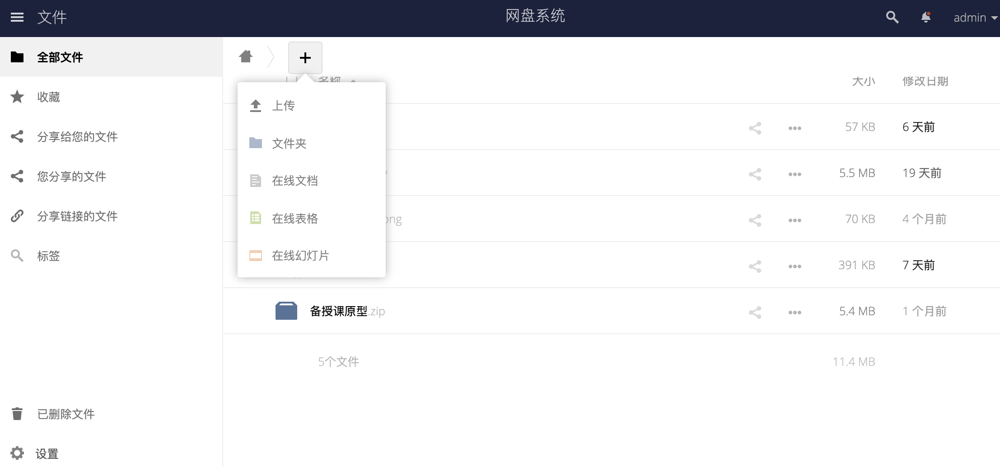

# 简介

## 石墨 SDK 是什么

- 石墨 SDK，是将石墨文档、表格、幻灯片等编辑器从全站产品中抽离出来，能够被第三方系统（如 IM、云盘）所单独集成的组件；
- 石墨 SDK 不关注用户帐号、文件权限、文件地址、文件路径等「内容之外的信息」。这些信息由第三方系统维护，使用时由 SDK 来调用即可；
- 石墨 SDK 支持：
  - 实时多人协作；
  - 保存正文内容，包括文字、图片、评论及其他元素，并记录这些内容的编辑者；
  - 保存编辑历史记录，支持版本回溯；
  - 导入、导出；
  - 预览文件；

## 石墨编辑器 SDK 接入形态

- 与 IM 集成；

  - 在 IM 中发送的本地 Office 文件，均可利用石墨编辑器 SDK 的导入能力，将其转化为具备一定权限范围（如：群成员可编辑）的在线文件。群成员可以访问链接，实现多人实时协作。文件本体归属于群空间或者企业云盘；
  - 在 IM 中可以直接新建空白在线文件，直接邀请群成员参与协作；
  - 在 IM 中可以选择云盘里的在线文件进行发送（入口同发送文件，实际上是发送链接）；
  - 在石墨编辑器 SDK 里，可以将文件发送至 IM 聊天，并赋予群成员相应权限（需对接）；

- 与云盘集成；
  - 在云盘中可以新建、导入、删除在线文件，并通过构造文件夹、标签等体系组织在线文件，和普通文件一起参与权限的设定；
  - 在云盘中可以将在线文件转发到 IM，并赋予群成员相应权限（需对接）；

_图例 - 云盘集成_

- 与 OA、审批及其他流程类办公系统集成；
  - 在各种流程类办公系统中，除了“添加本地文件”，还可以增加“添加在线文件”，将在线文件的链接作为附件加入流程。流转到每个节点时，可以自动让该节点的成员获得在线文件权限；
  - 为了防止在线文件在审批过程中被篡改，可以将权限设定为只能阅读或只能评论；如果流程里需要某节点进行多人协作编辑（多见于流程初期的信息收集，如表格），也可以开放对应权限；
