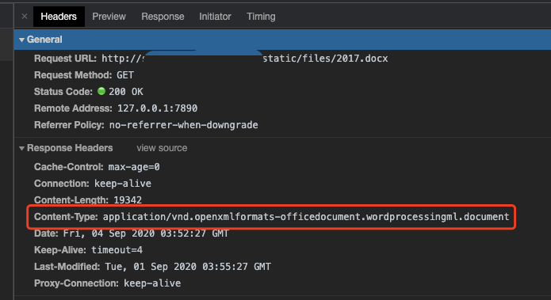

# 开始接入

:::caution 注意
⚠️ 请确保已阅读 [`接入须知`](./concepts/concepts.md#接入须知)。

⚠️ 请确保按照指定的 `地址`、`方法`、`HTTP Header` 来调用。
:::

## 申请 `appId`、`secret`

联系石墨获取用于对接石墨 SDK 的 `appId` 和 `secret`，获取后可进行如下操作:

- [获取 App 详情](./apis/edit.md#get-app-detail)
  - 用于查看 App 相关的详细信息
- [更新 app 回调地址](./apis/base.md#update-app-endpoint-url)
  - 更新石墨 SDK 请求接入方的回调地址 (更新生效时间约 1 分钟左右)

接入方需要妥善保管获取到的 `appId` 和 `secret`。

## 协同文档

开始接入协同文档前，需要接入方了解或准备以下事项：

- 访问时需要提供的 **签名** (参考 [签名的实现细节](./resources.md#签名) ) 参数
- 接入方开发的 **Web 页面** 用来承载石墨编辑器
- 开发若干 **回调接口**
  - 用于在石墨 SDK `协作` 或 `预览` 场景获取相应信息，常见功能对应需要实现的回调接口参考 [常见功能场景相关接口清单](./impl.md#features-api-list)

:::tip 提示
⚠️ 实现最基本的功能（能看到编辑器并编辑）至少需要接入方开发以下两个接口：

- [`获取文件元信息`](./impl.md#获取文件元信息-协同文档)
- [`获取当前用户信息`](./impl.md#获取当前用户信息)

如果要使用完整功能，请实现全部的 [`接入方实现接口`](./impl.md) 或根据 [`常见功能场景相关接口清单`](./impl.md#features-api-list) 实现部门需要的功能。
:::

### 接入流程 {#integration-steps}

1. 调用创建接口 [创建一个石墨文档](./apis/edit.md#create-collab-file)
2. 在接入方开发的 Web 页面中，引入 [石墨 JSSDK](./resources.md#js-sdk)
3. 根据 JSSDK npm 包里的 [README](https://www.npmjs.com/package/shimo-js-sdk) 按照提示初始化编辑器

## 文件预览

在线预览功能是指将 `docx`、`xlsx` 、`pptx` 等 Office 文件转换为能够在浏览器预览查看的形式展示。

:::caution 注意
⚠️ 此功能不支持编辑文档，如果要编辑文档，请参考 [`协同文档`](#协同文档)。
:::

### 支持格式 {#preview-supported-types}

| 文件类型   | 支持的扩展名格式                                           |
| :--------- | :--------------------------------------------------------- |
| Word 文件  | `.doc` `.docx` `.wps` `.wpt`                               |
| Excel 文件 | `.xls` `.xlsx` `.xlsm` `.csv`                              |
| PPT 文件   | `.ppt` `.pptx`                                             |
| PDF 文件   | `.pdf` `.rtf`                                              |
| TXT 文件   | `.txt`                                                     |
| 音频 文件  | `.mp3` `.mp4`                                              |
| 图片 文件  | `.jpg` `.jpeg` `.png` `.gif` `.bmp` `.svg` `.heic` `.heif` |
| 其它 文件  | `.ofd` `.rtf` `.md`                                        |

开始接入文件预览前，需要接入方了解或准备以下事项：

- [签名的实现细节](./resources.md#签名)

#### 接入说明

1. 使用[创建预览](./apis/edit.md#创建预览)来创建一个预览任务，需要在[获取文件元信息接口](./impl.md#获取文件元信息-文件预览) downloadUrl 字段中指定文件下载地址，比如：`http(s)://{domain}/static/files/2017.docx`，石墨服务器会从该地址下载文件并进行处理。需要确保该地址可以被石墨服务器正常访问到。

1. 通过[访问预览页面](./apis/edit.md#访问预览)实现文件预览。

### HTTP Response Header 要求

**⚠️ 注意：**

为了保证能够正确的识别文件类型，需要下载地址访问时的 HTTP Response **Header** 保证以下情况之一 (若返回不正确会遇到无法正确识别文件类型导致预览失败)：

#### Content-Disposition

HTTP Response**Header**中需要**返回正确的 Content-Disposition 信息** (参考 [MDN Content-Disposition](https://developer.mozilla.org/zh-CN/docs/Web/HTTP/Headers/Content-Disposition))，如下：

```
Content-Disposition: attachment; filename="yourfilename.docx"
```

#### Content-Type

HTTP Response**Header**中需要**返回正确的 Content-Type 信息**，如下



几种类型的 Content-Type 示例

| 扩展名 | 对应的 Content-Type 值                                                    |
| :----- | :------------------------------------------------------------------------ |
| doc    | application/msword                                                        |
| docx   | application/vnd.openxmlformats-officedocument.wordprocessingml.document   |
| xlsx   | application/vnd.openxmlformats-officedocument.spreadsheetml.sheet         |
| xls    | application/vnd.ms-excel                                                  |
| ppt    | application/vnd.ms-powerpoint                                             |
| pptx   | application/vnd.openxmlformats-officedocument.presentationml.presentation |
| pdf    | application/pdf                                                           |
| txt    | text/plain                                                                |

### 文件扩展名字段

在 [获取文件元信息接口-文件预览](./impl.md#获取文件元信息-文件预览) 的 `ext` 字段中返回该文件的扩展名信息。

如：

预览的文件下载地址 (`downloadUrl`) 为 `https://your-domain/static/files/1234` ，请求下载时接入方无法返回以下任意一种 Header 信息用于石墨 SDK 识别文件类型：

- `Content-Type`
- `Content-Disposition`

此时可通过元信息中返回的 `ext` 字段。

如 `ext: "docx"` 告知石墨 SDK 此文件的扩展名识别为 Word 文件，见以下回调接口示例高亮行。

```json title="通过回调接口中的 ext 字段指定文件类型"
{
  "id": "ba13551165cc5066",
  "name": "示例文档.docx",
  "type": "file",
  "permissions": {
    "readable": true
  },
  "downloadUrl": "http://example.com/download/test.docx",
  // highlight-next-line
  "ext": "docx" // 用于标识文件类型
}
```
